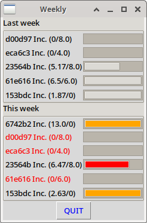

# Repo: public_zammad_tools
My public repo with tools for the Zammad helpdesk ticketing software

In this repo I publish a few tools I created for the Zammad application that helps me in my daily business.
I am a full-time Linux and Open Source consultant and I use Zammad a LOT!

What is in this repo?

- monthly-billing-report.sh. The name says it all. I use this every month when I bill my clients.
- weekly.sh. This app is started every morning to help me manage and focus on how I spend my time.

This file is the only documentation I provide. If you need support, you can email me and I will gladly make you an offer you can't refuse :-)

# monthly-billing-report.sh

When run it will first ask you for what year and what month you want the report to be created.
The 'end month' is the first month that is NOT included in the report.

For every organization in the Zammad database it will look and see if you spend some time working for them.
If so, it will generate a html file in the 'reports' subdirectory (not included in this repo, create it yourself).
This html file contains your company logo, a small header with organisation name and two lists.

The first list is a list of tickets you entered time on during the period entered.
The second list contains all the first lines of the articles, shopped of when they are too long and the time spend on that article.

I finally figured out how to administrate driving distance per ticket article if I happen to spend time outside the office. The time_unit field in ticket_time_accountings is numeric(6,2). I could enter the distance as the part after the decimal separator for distance up to 99 units (Km, miles).
Of course have to split the field and sum separately. Maybe some day....

## Installing

This script needs a configured .pgpass file in your home directory to be able to run.

# weekly.sh

Let's face it, I am sometimes chaotic, borderline ADD. Maybe I am ADD, I honestly don't know.
Recently I realised I needed a tool to help me focus on my work.
I wanted something that at day start would show my how I am doing workwise.
Basically an overview of the current week with the following information:
- Client name if there is an hour target defined, or there has been some time spend this week.
- Some target I created with the amount of work I would like to do for this client in a week at a minimum.
- The amount I have worked for that particular client already in this week.
- And a bar graph showing me my progress towards my target.
- And the bar graph can have a color:
  - Red when there is a target but I'm not there yet, 
  - Green when I have passed my target \0/
  - Orange when there is no target defined.

After having used it for a couple if days I realised I also wanted to see the previous week.
Maybe last week I spend way more time on a client than targeted, so I could relax a little this week. Or, the opposite of course.

The application looks like this (client names have been obfuscated for obvious reasons):

> For full disclosure: I am not a DBA. The SQL query in the python program is ugly AF! I know.
> There has to be a better and simpler way to get the same results.
> What can I say? It worked and I just was too busy. 
> Also see: https://github.com/kwoot/public_zammad_tools/issues/1

## Installing

To install this application you need a few things.
- The psycopg2 python driver for PostgreSQL
- The python tkinter gui library
- you MUST add an object to the Zammad system:
  - Go to the management section of Zammad.
  - Select 'Objects' in the "System" section.
  - Select 'Organization' at the top.
  - Click on the 'New Attribute' button.
  - In the 'NAME' field enter 'weeklyhours'. This has to be this text or your query will not work (unless you edit weekly.py of course)
  - In the 'DISPLAY' field enter something sensible like 'Weekly Hour target'
  - Make sure the 'ACTIVE' field shows 'active'.
  - Make sure the 'FORMAT' field shows 'Text'! This is the only way to be able to enter floating point values here.
  - Optionally enter a default value you like
  - Select a sensible 'MAXLENGTH' value. I would suggest at least '3'.
  - In the access rights matrix below check all checkboxes, unless you have good reason not to.
  
Obviously you have to edit the weekly.conf configuration file.

The shell script also needs editing to get a good DISPLAY variable setting. My setting is probably not your setting.

## Using the application

After everything is configured properly, go into the management section of Zammad and enter an hour target budget for those 
organizations you would like to see a target. You do NOT have to enter a target for every organization in your system.

Insert a call to weekly.sh into the crontab of your user and voila, a reminder appears at the start of every working day.
Crontab line example: 0 8 * * 1-5 /bin/bash /home/username/weekly.sh

Have fun!
Jeroen Baten
June 2020
